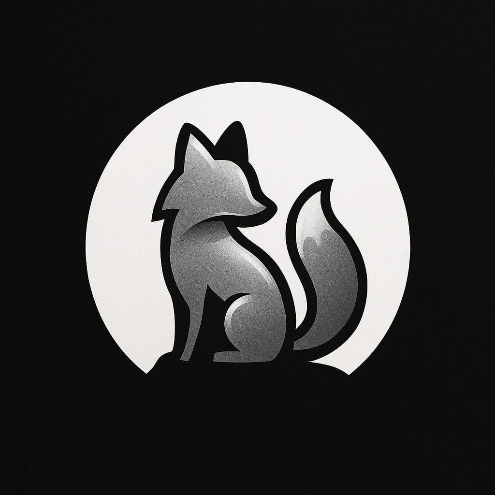

# 🦊 SilverFox - Adoção de Pets em Viçosa

## 📋 Descrição
O SilverFox é uma iniciativa que visa facilitar o processo de adoção de pets na cidade de Viçosa (MG), conectando animais que precisam de um lar a pessoas interessadas em adotar. Nossa plataforma busca ser uma ponte entre ONGs, protetores independentes e potenciais tutores, tornando o processo de adoção mais ágil e transparente.

## 💡 Motivação
Em Viçosa, assim como em muitas cidades brasileiras, existe um número significativo de animais em situação de abandono ou aguardando adoção. Ao mesmo tempo, muitas pessoas que desejam adotar um pet encontram dificuldades em localizar e conhecer os animais disponíveis. Queremos mudar essa realidade através da tecnologia.

## 🎯 Objetivos
- Criar uma plataforma digital intuitiva e acessível
- Centralizar informações sobre pets disponíveis para adoção em Viçosa
- Facilitar o contato entre doadores e adotantes
- Promover a adoção responsável
- Contribuir para a redução do número de animais abandonados na cidade

## 📊 Status do Projeto
O projeto encontra-se em fase inicial de desenvolvimento. Atualmente estamos:
- Definindo requisitos e funcionalidades
- Planejando a arquitetura do sistema
- Desenvolvendo protótipos de interface
- Estabelecendo parcerias com ONGs e protetores

## 👥 Nossa Equipe
Somos um grupo de desenvolvedores apaixonados por tecnologia e pela causa animal. A equipe SilverFox acredita que a tecnologia pode ser uma importante aliada na proteção e bem-estar dos animais.

## 🤝 Contribuições
Este é um projeto em desenvolvimento e estamos abertos a contribuições! Se você deseja participar ou tem sugestões, entre em contato conosco.

## 📬 Contato
[Em breve]

---
*"Conectando corações peludos a novos lares"* 🐾